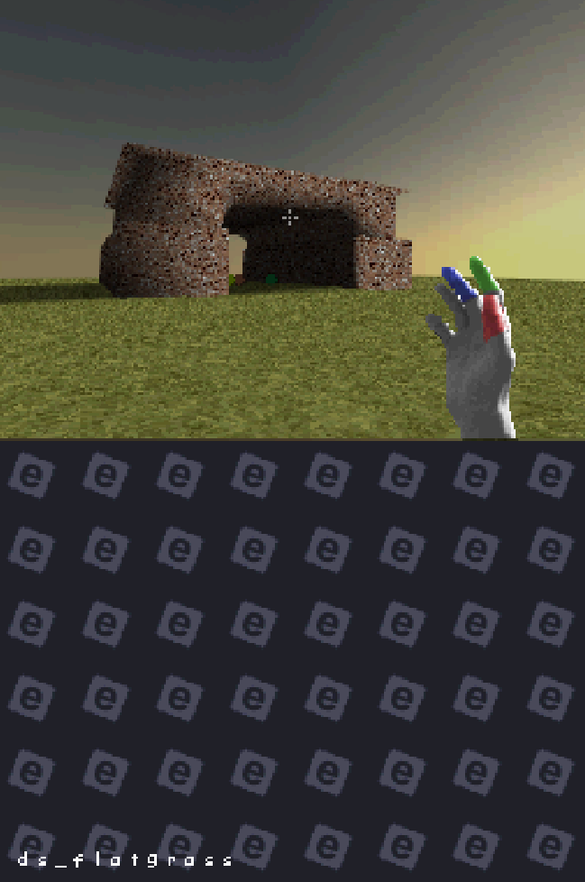

# emod DS

Sandbox prototype I wrote for the DS mainly to get better at C++ and get to study the architecture of the console. Developed over the course of two weeks, the project could possibly act as a good base for similar projects. You can watch the [youtube video here](https://www.youtube.com/watch?v=2UjE8xwp3L8).

The physics engine is mostly stable and hardly breaks. The weak point is the collision engine, it will occasionally break while using the minkowski sum to represent the player bounding box or checking the distance to a point (sphere), but it seems to not suffer these issues with simple points. I still can't figure out why.

## how the project is organized
Two different ROMs are built foreach CPU of the DS, as such there are two different source directories and a common one (source compiled for both CPUs).
### in common
|header| function |
|--|--|
| BSP.hpp | defines the BSP node structure and operations possible on a BSP tree. |
| cmap.hpp | collision map definition. each map then allocates it's data onto RAM at start up.
| fifoCommands.hpp | list of requests the ARM9 can send to the ARM7.

### ARM9
Most of the header and source files are self-explanatory. I will say to avoid some confusion that the ARM9 simulates the player on it's side instead of delegating it to the ARM7.
### ARM7
OBB.hpp is 1:1 copy of smea's code with some minor improvements and highly documented (I learned how to write DS code by this file alone). As I already explained in the video, OBBs never went implemented, and once the ARM7 WRAM problem is solved they could very easily be integrated.

## how to build the project
The project is built with [architect DS](https://github.com/AntonioND/architectds), along with the rest of the [blocksDS toolchain](https://blocksds.skylyrac.net/). It uses [nitro engine](https://github.com/AntonioND/nitro-engine), [nflib](https://github.com/knightfox75/nds_nflib) and maxmod.
 
